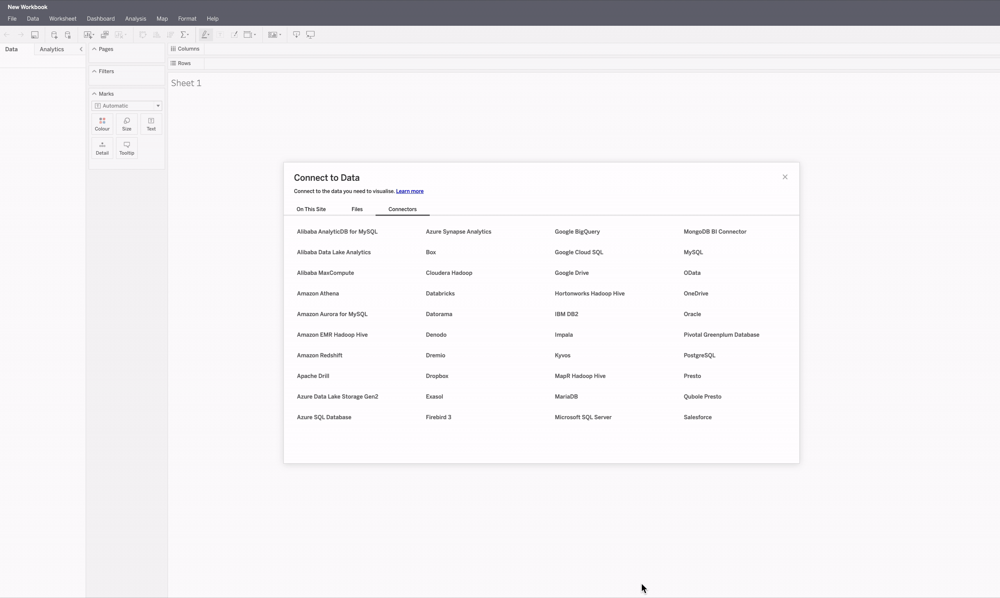

# tableau-athena-popup

# CAUTION
Use at your own risk since the values in `values.js` may be stored in plain text on your local disk.

# Usage
Click the pop-up to replace the labels with buttons that copy the preset values from the configurations (`config.js`) to the clipboard. 
- Support up to 3 configurations.
- Click the C1, C2, C3 buttons only after the target fields are generated.

# Flow / Content
1. Extension shows `popup.html` on click.
2. `popup.html` loads `popup.js` (and jquery).
3. `popup.js` has `onclick` events for C1, C2, C3 buttons that send messages to the content_scripts.
4. `tableau.js` has a listener that listen to the messages from the extension (or other tabs - which is not used).
5. Upon receiving the message, the target labels are replaced with the buttons.

To keep the extension simple, stuff like `background.service_worker` and `declarativeContent` permissions are excluded from the manifest.
